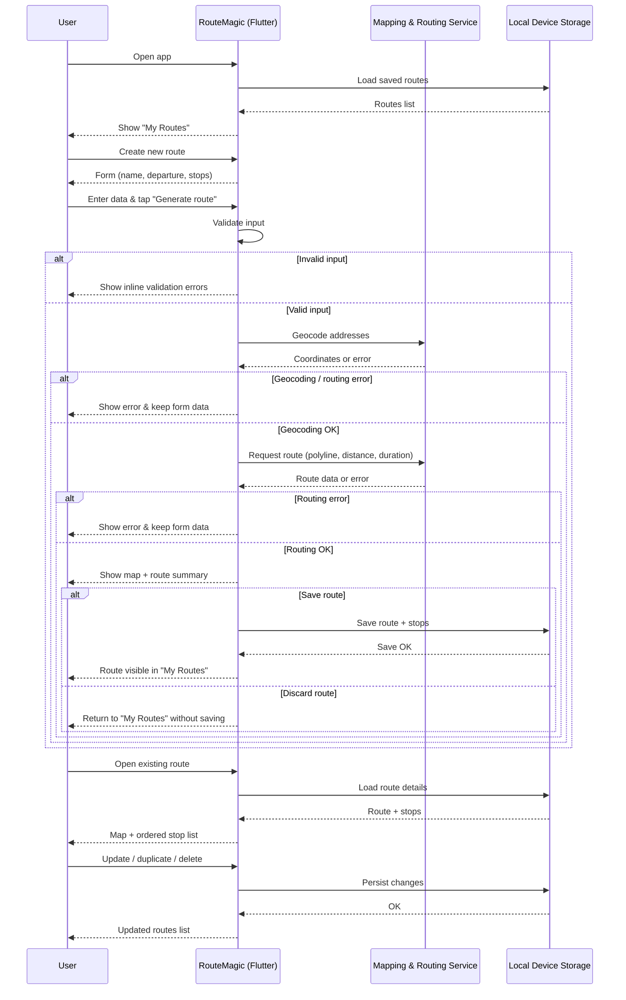

# RouteMagic

Mobile application for route planning, delivery sequencing, and basic logistics visibility.  
**Built with Flutter (Dart)** — designed as a client-side demo for delivery and field operations.

## Overview
RouteMagic helps drivers and operations teams build and review delivery routes on an interactive map.  
Users can create routes with multiple stops, see distance and time estimates, and quickly reopen or reuse saved routes for recurring trips.  

All user data (routes, stops, preferences) is stored locally on the device.  
Maps, geocoding, and routing rely on public map services accessed through Flutter plugins and require network connectivity.  
The application is engineered as a lightweight, self-contained mobile MVP suitable for demos, pilots, and app store distribution.

## Technical Overview
**Framework:** Flutter (Dart)  
**Architecture:** Client-side only (no backend services, no authentication layer)  
**Routing & Maps:** Public map services via Flutter plugins for geocoding, routing, and distance estimation  
**Data Storage:** Local device storage (client-side persistence, no external database)  
**Platforms:** Android · iOS  

## System Architecture

*The current architecture reflects a single-app, client-side design focused on map-assisted route planning with local persistence of user data.
This diagram is intentionally generic and does not reference any internal infrastructure or proprietary endpoints.
Routing, geocoding, and map rendering depend on online map services; viewing saved routes and basic details remains available when the device is offline.*

## Key Features

- Create routes with a named departure point and multiple delivery stops  
- See route distance and estimated travel time on an interactive map  
- Save, reopen, update, duplicate, and delete routes on the device  
- Limited offline support: saved routes and details remain available without network connectivity, while maps and routing require an active internet connection  
- Light and dark theme support with local preference storage  
- Designed as a clean, minimal mobile experience for logistics demos and pilots  

## Product Preview

*Interface previews of RouteMagic, based on final mobile UI design.*

  
  
  

  From routes list to route creation and map-based route review.

## Status

**Active / Mobile MVP**  
This repository provides public documentation and assets for the RouteMagic demo application.  
Further source code or build artifacts can be shared or extended as part of client projects and pilots.

## Related Projects

- [WordWave](https://github.com/webmagic-agency/wordwave) – AI video-to-text transcription SaaS  
- [CargoMagic](https://github.com/webmagic-agency/cargomagic) – desktop cargo volume and load planning tool  

## Maintained by WebMagic

[WebMagic](https://webmagic.agency) — custom web and AI systems for logistics, e-commerce, and SaaS.

### Security Disclaimer

This repository serves as a **public showcase** for demonstration purposes only.  
No credentials, secrets, or proprietary infrastructure details are exposed.  

RouteMagic, in its demo form:

- Uses public map services for routing and map tiles.  
- Stores all user data (routes, stops, preferences) locally on the device.  
- Does not implement user accounts, roles, or multi-tenant isolation.  

It is not intended, in this form, for handling regulated or highly sensitive production data.  

